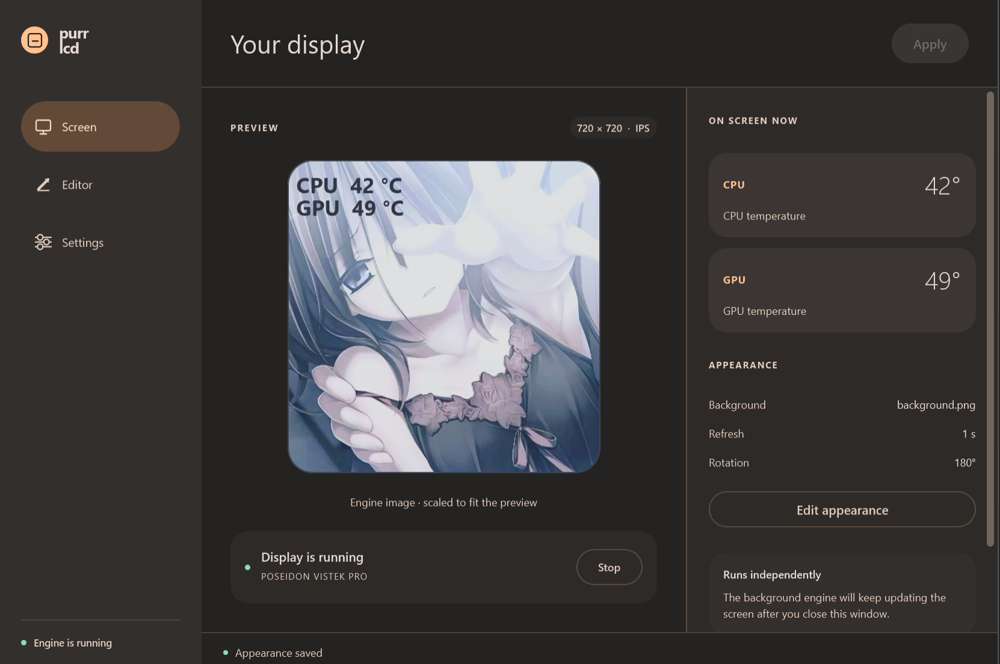
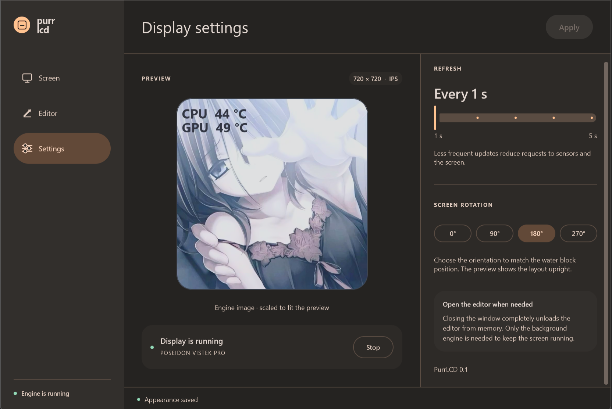
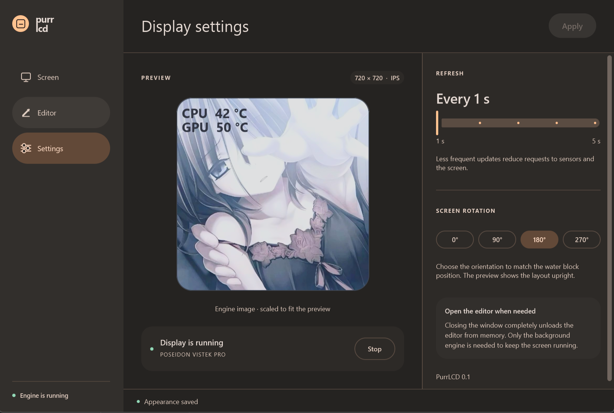

# PurrLCD

I hate Electron, so I built this for my own use.

A replacement for COUGAR LCDEditor, with a C++ background process and a separate Compose Desktop / Material 3 editor. Close the editor and the LCD keeps running without the JVM.

## Features

- Image or solid-color background.
- CPU/GPU temperatures with editable labels, positions, font sizes and colors.
- Live preview with draggable temperature layers.
- Display rotation in 90° steps and a 1–5 second update interval.
- Saved layouts, tray controls and reconnection after restarting the background process.

No GIF/video playback, custom layer types, Windows startup registration, or pump/fan control yet.

## Compared with LCDEditor

Measured on [my hardware](#hardware) on October 5, 2026: 120 seconds per application, sampled every 2 seconds. PurrLCD's editor was closed; LCDEditor was manually minimized to the tray.

| Resource | LCDEditor 1.0.14 | PurrLCD |
| --- | ---: | ---: |
| Average CPU usage | 1.12% | 0.040% |
| Average summed working set | 713.6 MiB | 24.6 MiB |
| Average private commit | 494.2 MiB | 74.6 MiB |
| Processes counted | 5 | 1 |

About **28 times less CPU** in these runs. CPU percentages are normalized across all 16 logical processors.

Summed working sets can count shared pages more than once; they are not unique physical RAM usage. Private commit is a separate allocation counter. The main LCDEditor process alone averaged 214.1 MiB working set; the table includes all five processes.

[Method, conditions and raw JSON/CSV measurements](docs/benchmarks/2026-10-05/README.md).

## Screenshots

<p>
  <a href="docs/screenshots/display.png"></a>
  <a href="docs/screenshots/settings.png"></a>
  <a href="docs/screenshots/settings-hover.png"></a>
</p>

## Hardware

**This project is currently built specifically for my own hardware. Support for other setups has not been implemented or verified.**

- **AIO:** COUGAR Poseidon Vistek Pro ARGB 360, 720 × 720 LCD, USB HID `1D6B:0110`
- **CPU:** AMD Ryzen 7 5700X
- **GPU:** AMD Radeon RX 9070 XT
- **OS:** Windows x64

CPU temperature uses an installed [PawnIO](https://pawnio.eu/) driver and the bundled `AMDFamily17.bin` module. The current sensor implementation targets AMD family 19h/model 21h and requires the background process to run as administrator. GPU temperature uses AMD ADLX from the installed AMD driver. PurrLCD does not install either driver.

## Build

Requires Windows x64, an x64 **LLVM-MinGW** compiler with C++17 support, **JDK 21**, and internet access for the first build. Close PurrLCD and its editor before building.

To build with GPU temperature support:

```powershell
.\engine\sensors-vendor\fetch-adlx.ps1 -Destination .\.tools\adlx-1.5
.\build.ps1 `
  -Clang C:\tools\llvm-mingw\bin\x86_64-w64-mingw32-clang++.exe `
  -AdlxInclude .\.tools\adlx-1.5
```

Omit `-AdlxInclude` to build without ADLX; GPU temperature will be unavailable. `-SkipEditor` builds only the background process. The build runs tests and writes the application to `app/`, preserving `app/data/`. Java is included in the editor package.

## Run

1. Exit the original LCDEditor, including its tray process.
2. Launch `app/editor/PurrLCDEditor.exe` and approve elevation for the background process.
3. Edit the layout, click **Apply**, then **Connect**.
4. Close the editor. Use the tray icon to reopen it or exit PurrLCD.

A successful connection enables reconnection on the next launch. **Stop** disables it. Settings and backgrounds are stored in `app/data/`; keep that folder when moving the application.

## Source

- [`engine/`](engine/) — sensors, rendering, USB HID, IPC and tray controls; [LCD protocol notes](engine/PROTOCOL.md).
- [`editor/`](editor/) — Kotlin / Compose Desktop editor; [build and development notes](editor/README.md).
- `app/`, `.work/`, `.tools/` — local application, build output and tools; excluded from Git.

## License

[MIT](LICENSE) for PurrLCD's own code. See [THIRD_PARTY.md](THIRD_PARTY.md) for dependency licenses, including the optional AMD ADLX SDK.

Unofficial project, not affiliated with COUGAR.

Developed with assistance from ChatGPT Codex.
